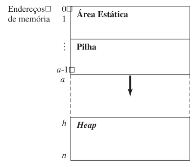
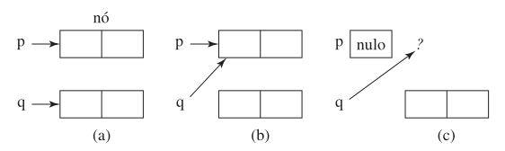
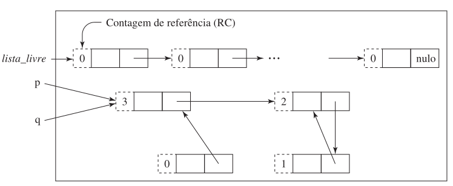

Capítulo 11

# 11 GERENCIAMENTO DE MEMÓRIA

- **Área estática:** Contém valores cujos requisitos de armazenamento são conhecidos antes da execução e permanecem constantes por toda vida do programa.

- **Pilha em tempo de execução:** Centro de controle para despachar funções ativas. Variáveis declaradas localmente e a ligação parâmetro-parâmetro.

- **Heap:** Contém valores que são alocados e estruturados dinamicamente enquanto o programa está sendo executado.



<br>
&esmp; **Problema:** Fragmentação.<br>
&emsp; Coleta de lixo. <br>
&emsp; Não definida, [new, em C++ criou e não sabe o que tem naquela parte da memória]<br>
&emsp; não usado, [delete, apagou e ficou na memória]<br>
&emsp; valor elementar [ainda está sendo usado]<br>


<br>

- **Overflow de heap:** Ocorre quando a função new é chamada e a heap não contém um bloco contíguo de palavras não usadas grande o suficiente.

### C
```c
int A[n]; // A[0] ... A[N-1] -> Heap
// int A -> Pilha
```

- **Lixo:** Todo bloco da heap que não possa ser acessado pelo programa.

## 11.3 COLETA DE LIXO 
Estratégia para recuperação de blocos de heap não usados para uso posterior pelo programa.

## 11.3.1 CONTAGEM DE REFERÊNCIA
Supõe que a heap inicial seja uma cadeia contínua de nós chamados de lista_livre (free_list), na qual cada nó tem um campo inteiro adicional que contém um contador do número de ponteiros referenciando esse nó (inicialmente 0).




