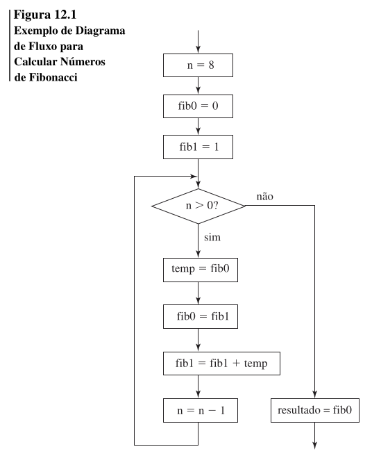

Capítulo 12

# 12. PROGRAMAÇÃO IMPERATIVA

- John Von Newmann <br>

- **Armazenamento do Programa:** Instruções. <br>
- **Armazenamento de Dados:** Valores 

<br><br>

- Atribuição: Alterar o valor do local de memória e destruir seu valor anterior. <br>
- Declaração de variáveis, expressões, comandos, condicionais, laços e abstração precedural. <br>
- Execução sequencial. <br>
- **Fluxogramas** <br>


<br>

- Completa quanto a Turing: Atribuição, Ramificação e Condicionais.
<br>
- Suporta: Estruturas de Controle, Entrada/Saída, Exceções, Abstração Procedural, Expressões e atribuição, Suporte de bibliotecas e EADs (Estruturas e Algoritmos de Dados).
<br>

## 12.2 ABSTRAÇÃO PROCEDURAL
O processo de abstração procedural permite ao programador se preocupar principalmente com a interface entre a função e o que ela calcula, ignorando os detalhes de como o cálculo é executado.
<br>

- **Refinamento Gradual:** O processo de refinamento gradual utiliza abstração procedural desenvolvendo um algoritmo da sua forma mais geral para uma implementação específica. 
<br>
- Em C: Semântica de cópia.
<br>
- Em C **NÃO** oferece: Iteradores, Exceções, Sobrecarga e Genéricos.
### C

```c
template <T>
T max(T a, T b) {
    return (a > b) ? a : b;
}

// outro método

void strcpy(char *p, char *q) {
    while (*p++ = *q++);
}
```


