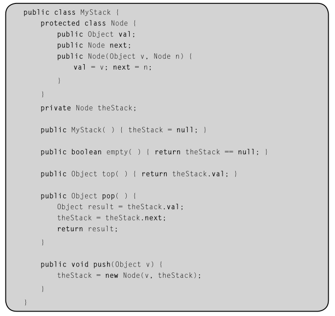
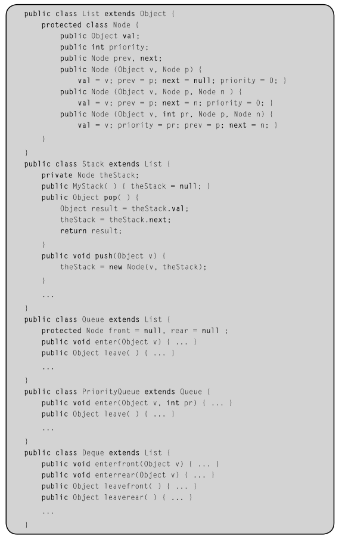
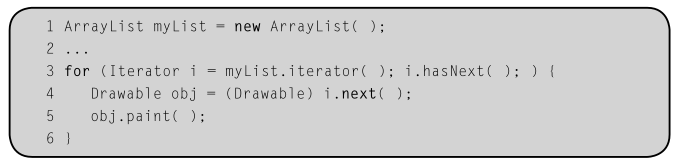
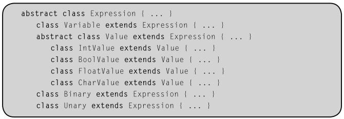
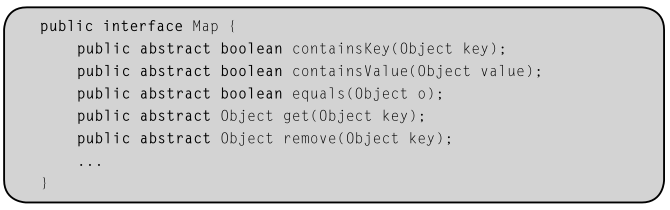

Capítulo 13

# 13 PROGRAMAÇÃO ORIENTADA A OBJETOS

## 13 ABSTRAÇÃO DE DADOS
```c
typedef struct Pilha pilha;

Pilha* criar Pilha();

void freePilha(Pilha** ptr);

```

## 13.1 PRELÚDIO: TIPOS DE DADOS ABSTRATOS
- **Encapsulamento:** Encapsulamento é um mecanismo que permite que constantes logicamente relacionadas, tipos, variáveis, métodos, entre outros, sejam agrupados em uma nova entidade. Exemplos incluem procedimentos, pacotes e classes. 
<br>
&emsp; - Problema: Dificuldade em estender;<br>
&emsp; &emsp; Necessidade de oferecer funcionalidades.

## 13.2.1 CLASSES
Uma classe é uma declaração de tipo que encapsula constantes, variáveis e funções para manipulação dessas variáveis. 

<br>

- **Variáveis de instância:** Variáveis locais de uma classe. 

<br>

- **Construtores e Destrutores, Métodos**

<br>

- **Objeto != Classe** ----> Cliente

<br><br>

- **Classe interna:** <br>
```java
public class MyStack {
    private class Node {
        ...
    }

    ...

    Node head;
}
```

<br>

- **Métodos da classe/estáticos vs de instância** <br>
^ &emsp; &emsp; &emsp; ^ <br>
| &emsp; &emsp; &emsp; | <br>
Const. e Dest. &emsp; &emsp; Via objeto 

<br><br>

- **Papéis da clase:** <br>
1. Determinar o tipo; <br>
2. Verificação de tipo.
<br>
## 13.2.2 VISIBILIDADE E OCULTAMENTO DE INFORMAÇÃO
public, private e protected 



## 13.2.3 HERANÇA
**Herança simples:** Java
<br>
Super classe e Sub classe. <br>
&emsp; - **Benefício:** Reutilização de código.

<br>

- **Agregação:** Uma classe C1 é uma agregação de yna ckasse C2, se C1 contém objetos do tipo C2.

## 13.2.4 HERANÇA MÚLTIPLA
**Herança Múltipla:** C++.

<br>

- **Vantagem:** Reutilização.
<br>
- **Desvantagem:** Bagunça.



## 13.2.5 POLIMORFISMO
Instância
<br>
- **Princípio da substituição:** Cada instância deve executar a mesma função abstrata, com apenas o código sendo particularizada pelo objeto.

<br>

## 13.2.6 MODELOS
Um modelo define uma família de classes parametrizadas por um ou mais tipos.

<br>



## 13.2.7 CLASSES ABSTRATAS
Uma classe abstrata é uma classe declarada como abstrata ou que tem um ou mais métodos abstratos. 
<br>
Um método abstrato é um método que não contém código além de sua assinatura.



## 13.2.8 INTERFACES

